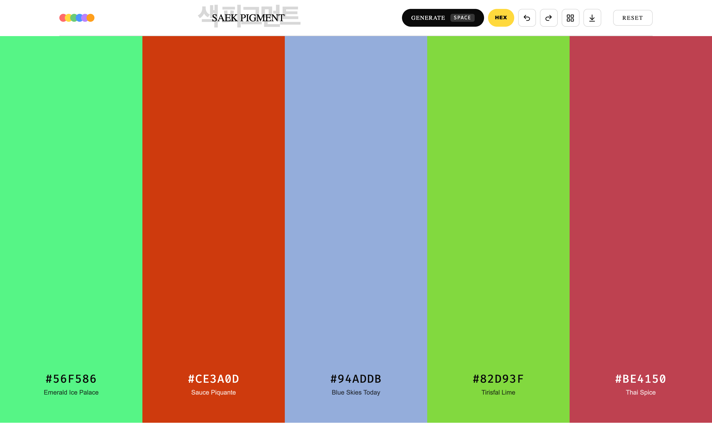
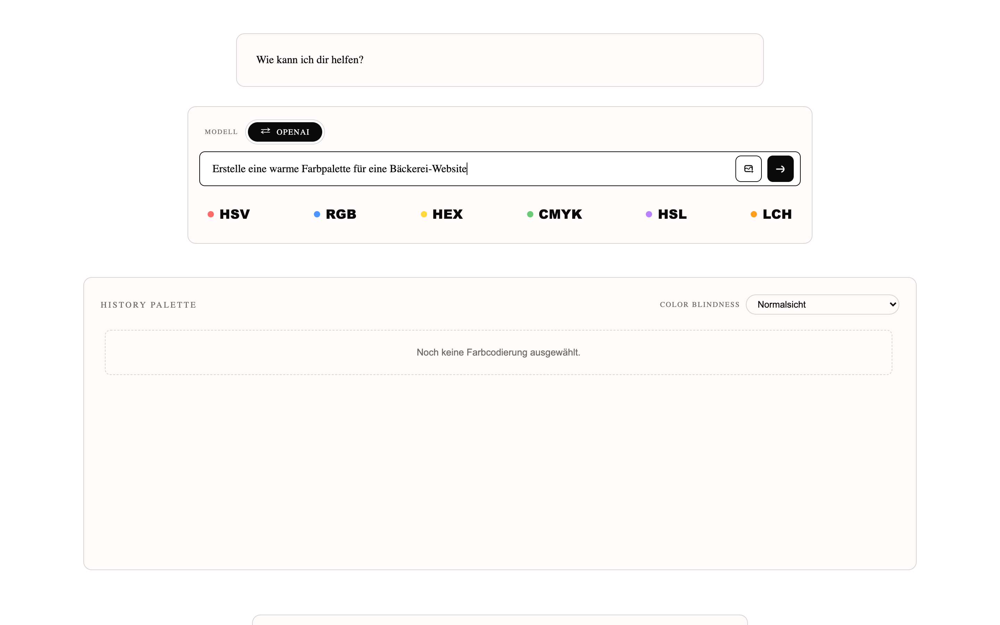
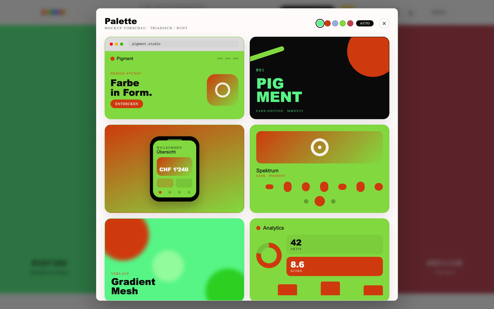
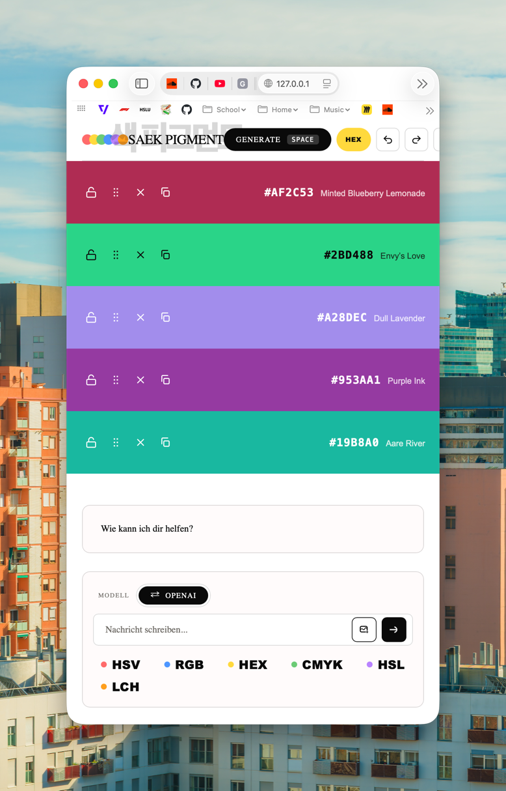

# Projektdokumentation

## Angaben zur Arbeit

| Feld | Inhalt |
|------|--------|
| **Titel der Arbeit** | Color Palette AI Agent |
| **Name / Vorname** | Fankhauser, Sandro |
| **Art der Arbeit** | Einzelarbeit (keine Gruppenarbeit, daher keine Rollenverteilung) |
| **Studiengang** | BSc Digital Ideation, Vertiefung Informatik |
| **Modul / Semester / Jahr** | DEWEB (mit COMPP-Teil) / FS26 / 2026 |

## Kurzbeschrieb

> Ein spezialisierter KI-Agent rund um Farben: er schlägt harmonische Paletten und Farbcodes vor. Dazu kommen CLI-Tools, Bildanalyse und lokale Design-Helfer wie Kontrast, Mockup und Farbblindheit.

## Aufgabenbeschrieb (welches Problem musste gelöst werden)

Farbentscheidungen kosten im Design oft viel Zeit, und allgemeine Chatbots helfen dabei nur mässig, weil sie nicht auf Farbtheorie spezialisiert sind. Ziel war ein **spezialisierter KI-Agent**, der genau eine Sache richtig gut kann: stimmige Farbpaletten vorschlagen, die passenden Farbcodes liefern und konkrete Designtipps geben. Das Ganze sollte in einer verspielten, ansprechenden Weboberfläche laufen und dem Anwender die Wahl zwischen lokalem und Cloud-Sprachmodell lassen.

## Methode

- **Spezialisierter Chat-Agent:** Ein eng gefasster System-Prompt hält den Agenten beim Thema Farbe (Farbtheorie, Farbcodierung, Paletten, Farbnamen).
- **LLM-Anbieter zur Wahl:** OpenAI und GitHub Copilot (Cloud) sowie Ollama (lokal), umschaltbar im Web-UI, ohne automatischen Fallback, damit Fehler sichtbar bleiben.
- **CLI-Werkzeuge:** Fünf Basis-Tools (`read_file`, `list_files`, `edit_file`, `code_search`, `bash`) plus `subagent`, mit dem der Agent für Teilaufgaben eigenständige Helfer-Agenten startet, auch mehrere parallel.
- **Bildanalyse (COMPP):** Hochgeladene Bilder werden über die Replicate-API analysiert und in eine Palette übersetzt.
- **Lokale Design-Tools (ohne LLM):** Farbformat-Buttons, Coolors-artiger Randomizer, History-Palette mit PNG-Export, WCAG-Kontrastprüfung, Mockup-Vorschau über sechs Layouts und eine Farbblindheits-Simulation.
- **Interface-Effekte:** Zwei Audio-Cues (Web Audio API) und mehrere CSS-Animationen sorgen für das "fancy" Web-Geschirr.

## Ergebnisse

Es ist eine einzige, lauffähige Bun-Webanwendung entstanden, die beide Module (DEWEB + COMPP) vereint. Der Agent liefert auf eine Anfrage hin harmonische Paletten samt passender Farbcodes und Designempfehlungen, und der gesamte Farb-Workflow von der Bildanalyse über die Anpassung bis zur Mockup-Vorschau und zum PNG-Export läuft an einem Ort im Browser ab. Die lokalen Design-Tools funktionieren auch ganz ohne Sprachmodell.

## Werkzeuge / CLI-Tools (5 + 1)

Die Modulvorgabe verlangt fünf Basis-Tools plus ein zusätzliches. Laut Absprache durfte das Zusatz-Tool entweder selbst gewählt oder eines der vorgegebenen sein.

| # | Tool | Herkunft |
|---|------|----------|
| 1 | `read_file` | Basis |
| 2 | `list_files` | Basis |
| 3 | `edit_file` (inkl. write) | Basis |
| 4 | `code_search` | Basis |
| 5 | `bash` | Basis |
| +1 | `subagent` | vorgegebenes Zusatz-Tool |

Zusätzlich liegt `play_mp3` (Audiowiedergabe via `mpg123`) im Projekt. Es wird **nicht** als eines der geforderten Tools gezählt, sondern ist eine optionale Zusatzfähigkeit.

## Deklaration von geistigem Eigentum

**Eigenleistung:** Der HTML-Aufbau, die Button- und UI-Logik, die LLM- und Replicate-Integration, die Kern-Agentenschleife sowie die Tool- und Design-Tool-Logik wurden selbst erstellt. KI (Claude Code, Anthropic) kam als Programmierassistenz zum Einsatz: für Refactoring und Aufräumarbeiten, beim Debugging, für viele Designentscheidungen und als Quelle für Ideen und Inspiration. Sämtlicher KI-generierte Code wurde überprüft, getestet und angepasst (Details siehe [WIKI.md — AI Declaration](WIKI.md#ai-declaration)).

**Verwendete Drittquellen (Open Source / externe Dienste):**

| Quelle | Verwendung | Lizenz/Art |
|--------|-----------|-----------|
| [meodai/color-name-api](https://github.com/meodai/color-name-api) (Instanz [api.color.pizza](https://api.color.pizza)) | Farbnamen für Hex-Werte | Open Source |
| [bbc/color-contrast-checker](https://github.com/bbc/color-contrast-checker) | WCAG-Kontrast-Schwellen | Open Source |
| [chroma.js](https://github.com/gka/chroma.js) | wahrnehmungsgleiche Palettenmischung | Open Source (BSD) |
| [Replicate](https://replicate.com) — [lucataco/ollama-llama3.2-vision-90b](https://replicate.com/lucataco/ollama-llama3.2-vision-90b) | Palettenextraktion aus Bildern | gehosteter Dienst |

**Bild 2 — KI-Agent mit Format-Buttons und History-Palette, Querformat**

**Bild 3 — Mockup-Vorschau über sechs Layouts, Querformat**

**Bild 4 — App im schmalen Fenster (Palette „Saek Pigment" + Chat), Hochformat**

