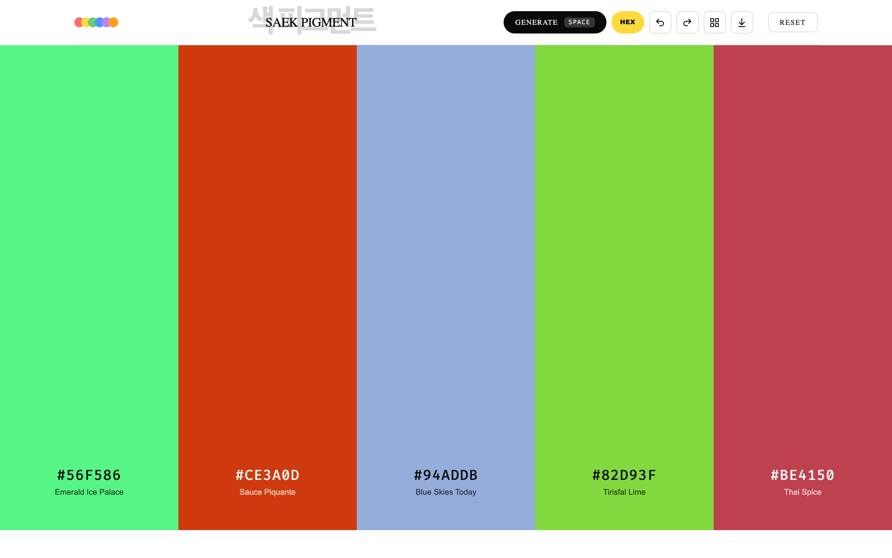
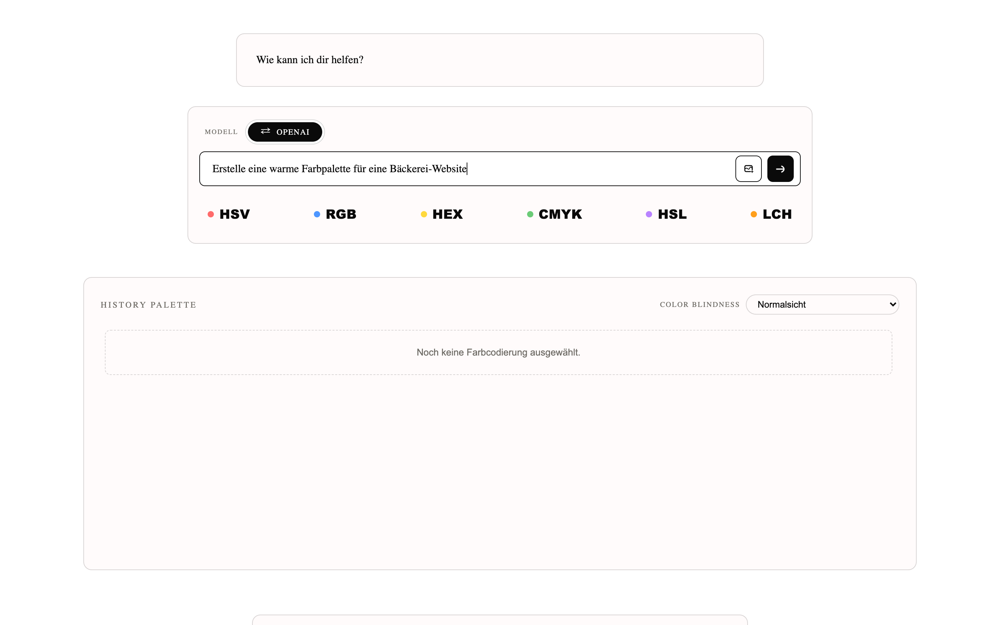
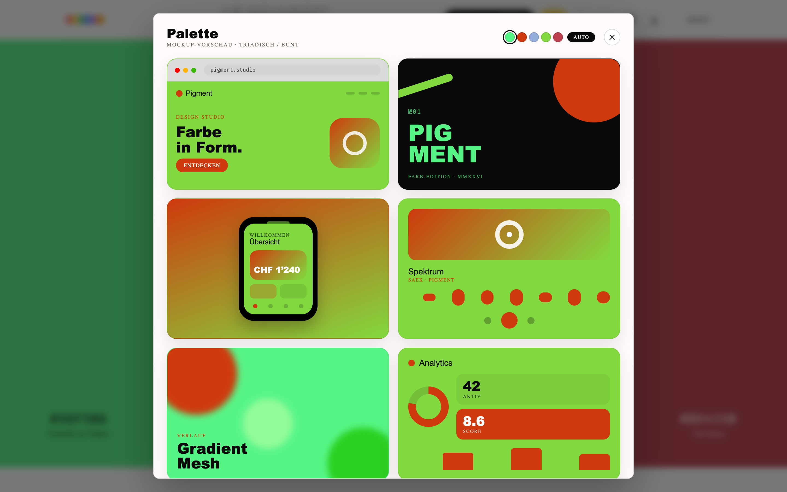
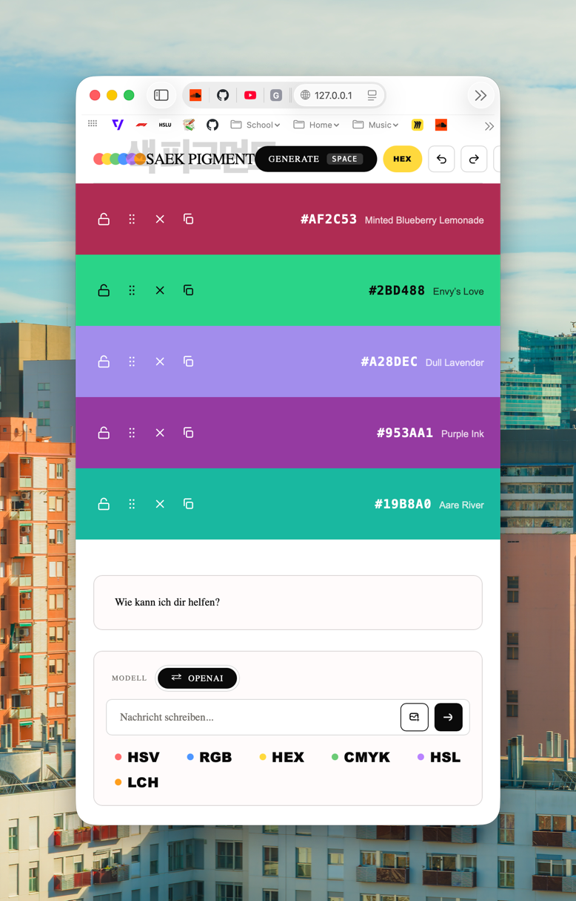

# Project Documentation

## Project Details

| Field | Content |
|------|--------|
| **Title** | Color Palette AI Agent |
| **Name / First name** | Fankhauser, Sandro |
| **Type of work** | Individual work (no group work, so no role distribution) |
| **Degree programme** | BSc Digital Ideation, Computer Science specialization |
| **Module / Semester / Year** | DEWEB (with COMPP part) / FS26 / 2026 |

## Short Description

> A specialized AI agent for color: it suggests harmonious palettes and matching codes, plus CLI tools, image analysis and local design helpers like contrast, mockup and color-blindness simulation.

## Task (which problem had to be solved)

Color decisions often eat up a lot of time in design, and general chatbots are only of limited help because they are not specialized in color theory. The goal was a **specialized AI agent** that does exactly one thing really well: suggest coherent color palettes, deliver the matching color codes and give concrete design tips. All of it should run in a playful, appealing web interface and let the user choose between a local and a cloud language model.

## Method

- **Specialized chat agent:** A tightly scoped system prompt keeps the agent on the topic of color (color theory, color encoding, palettes, color names).
- **LLM providers to choose from:** OpenAI and GitHub Copilot (cloud) plus Ollama (local), switchable in the web UI, with no automatic fallback so errors stay visible.
- **CLI tools:** Five base tools (`read_file`, `list_files`, `edit_file`, `code_search`, `bash`) plus `subagent`, which lets the agent spin up independent helper agents for subtasks, several in parallel.
- **Image analysis (COMPP):** Uploaded images are analyzed via the Replicate API and turned into a palette.
- **Local design tools (no LLM):** Color-format buttons, a Coolors-style randomizer, a history palette with PNG export, a WCAG contrast check, a mockup preview across six layouts and a color blindness simulation.
- **Interface effects:** Two audio cues (Web Audio API) and several CSS animations provide the "fancy" web harness.

## Results

A single, runnable Bun web application emerged that unites both modules (DEWEB + COMPP). On a request, the agent returns harmonious palettes together with the matching color codes and design recommendations, and the whole color workflow from image analysis through adjustment to mockup preview and PNG export runs in one place in the browser. The local design tools work entirely without a language model.

## Tools / CLI Tools (5 + 1)

The module requirement calls for five base tools plus one extra. As agreed, the extra tool could be either self-chosen or one of the provided ones.

| # | Tool | Origin |
|---|------|--------|
| 1 | `read_file` | Base |
| 2 | `list_files` | Base |
| 3 | `edit_file` (incl. write) | Base |
| 4 | `code_search` | Base |
| 5 | `bash` | Base |
| +1 | `subagent` | provided extra tool |

In addition, `play_mp3` (audio playback via `mpg123`) is included in the project. It is **not** counted as one of the required tools but is an optional extra capability.

## Declaration of Intellectual Property

**Own work:** The HTML structure, the button and UI logic, the LLM and Replicate integration, the core agent loop as well as the tool and design-tool logic were created by myself. AI (Claude Code, Anthropic) was used as a coding assistant: for refactoring and cleanup, for debugging, for many design decisions and as a source of ideas and inspiration. All AI-generated code was reviewed, tested and adapted (details see [WIKI.md — AI Declaration](WIKI.md#ai-declaration)).

**Third-party sources used (open source / external services):**

| Source | Used for | License / Type |
|--------|----------|----------------|
| [meodai/color-name-api](https://github.com/meodai/color-name-api) (instance [api.color.pizza](https://api.color.pizza)) | Human-readable names for hex values | Open source |
| [bbc/color-contrast-checker](https://github.com/bbc/color-contrast-checker) | WCAG contrast thresholds | Open source |
| [chroma.js](https://github.com/gka/chroma.js) | Perceptually even palette blending | Open source (BSD) |
| [Replicate](https://replicate.com) — [lucataco/ollama-llama3.2-vision-90b](https://replicate.com/lucataco/ollama-llama3.2-vision-90b) | Palette extraction from images | Hosted service |

## Submitted Images

All images are **my own screenshots of the application**. © 2026 Sandro Fankhauser, based on my own code. Suggested license: **CC BY 4.0** (www.creativecommons.ch). Landscape images: 2880 × 1800 px, RGB, PNG.

**Image 1 — Color randomizer (landing), landscape**

**Image 2 — AI agent with format buttons and history palette, landscape**

**Image 3 — Mockup preview across six layouts, landscape**

**Image 4 — App in a narrow window (palette "Saek Pigment" + chat), portrait**

## File Naming for Submission (Zip)

As required: `fankhauser_sandro_2026_deweb`
